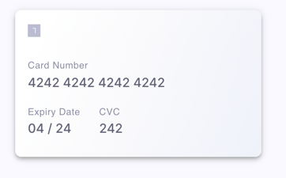

# OCR Example

This example repository shows how to perform [Optical Character Recognition (OCR)](https://en.wikipedia.org/wiki/Optical_character_recognition) in virtual credit card image using [Tesseract.js](https://tesseract.projectnaptha.com), by leveraging Basis Theory CDE.

In this setup, a virtual credit card image is provided via a URL. The Cardholder Data contained in the image is considered sensitive and regulated by PCI DSS, so the image will be downloaded and analyzed in a [Basis Theory Reactor](https://developers.basistheory.com/docs/concepts/what-are-reactors), which will tokenize the image data into a [card token](https://developers.basistheory.com/docs/api/tokens/#card-object) by executing custom code ([formula.js](./formula.js)).



## Provision Resources with Terraform

[Create a new Management Application](https://portal.basistheory.com/applications/create?name=Terraform&permissions=application%3Acreate&permissions=application%3Aread&permissions=application%3Aupdate&permissions=application%3Adelete&permissions=reactor%3Acreate&permissions=reactor%3Aread&permissions=reactor%3Aupdate&permissions=reactor%3Adelete&type=management) with full `application` and `reactor` permissions.

Paste the API key to a new `terraform.tfvars` file at this repository root:

```terraform
management_api_key = "key_W8wA8CmcbwXxJsomxeWHVy"
```

Initialize Terraform:

```shell
terraform init
```

And run Terraform to provision all the required resources:

```shell
terraform apply
```

## Invoke the Reactor

Using the `reactor_id` and `reactor_api_key` generated as a Terraform state outputs, make the following request passing the example image url in the payload:

```shell
curl -L -X POST 'https://api-dev.basistheory.com/reactors/{{reactor_id}}/react' \
-H 'Content-Type: application/json' \
-H 'Accept: application/json' \
-H 'BT-API-KEY: {{reactor_api_key}}' \
--data-raw '{
  "args": {
      "url": "https://raw.githubusercontent.com/Basis-Theory-Labs/ocr-example/dc7a8dfcc5a837352fa502c2b2d270e0868dd8ae/card.png"
  }
}'
```

> Make sure to replace the variables above with the Terraform outputs stored in Terraform state.

You should receive a [Create Token Response](https://developers.basistheory.com/docs/api/tokens/#create-token) in a `token` raw attribute. 

## Tests

The [formula.test.js](formula.test.js) file shows how the response transform code can be tested. To run it, install dependencies with:

```shell
yarn install
```

And run the command:

```
yarn test
```
